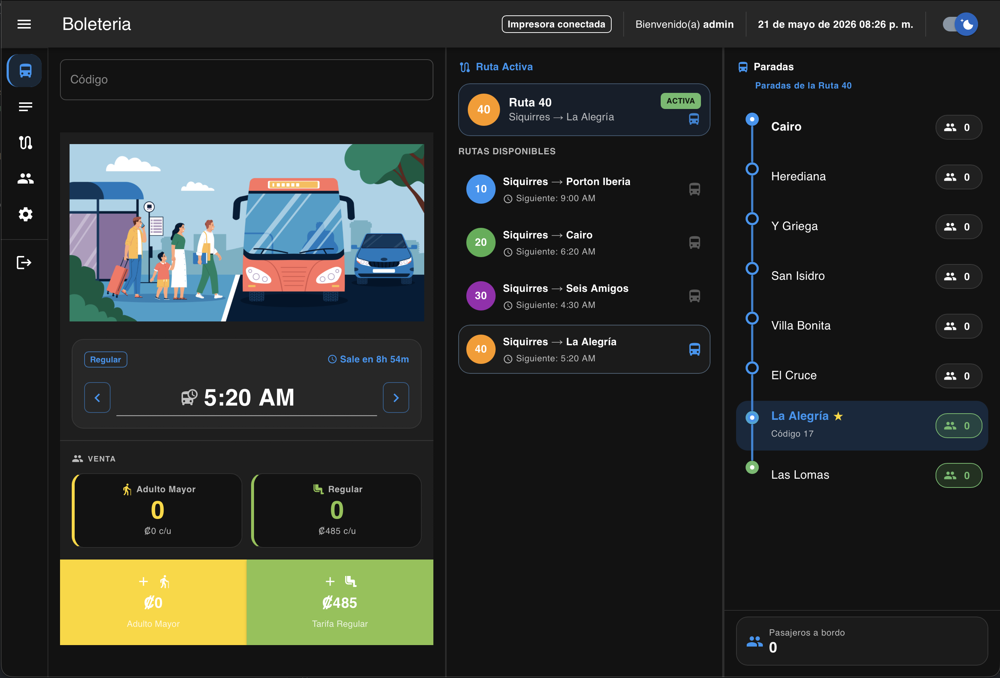
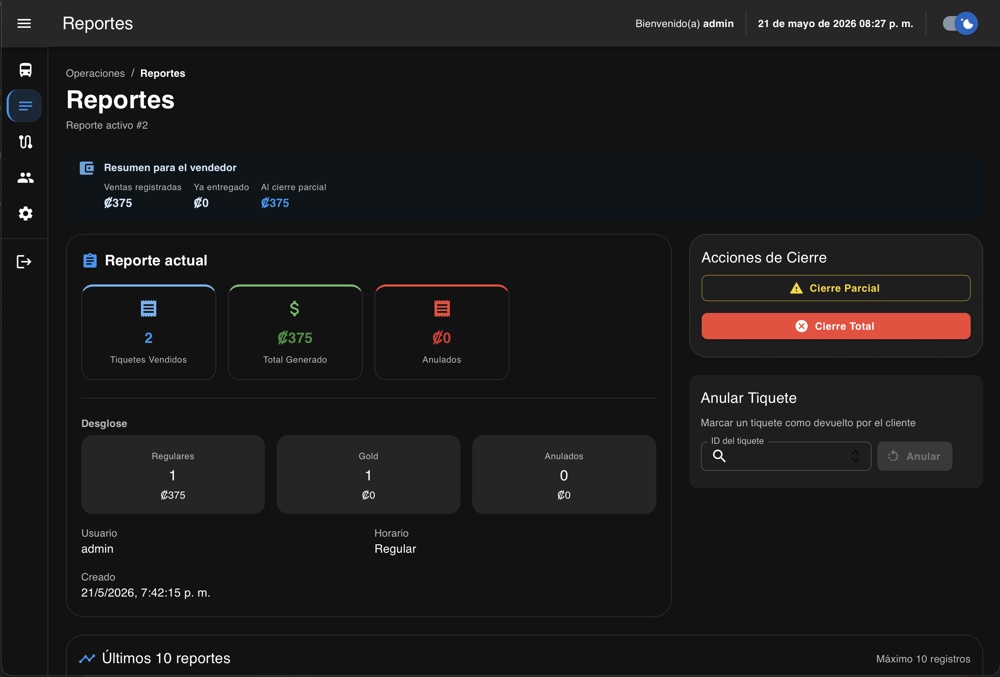
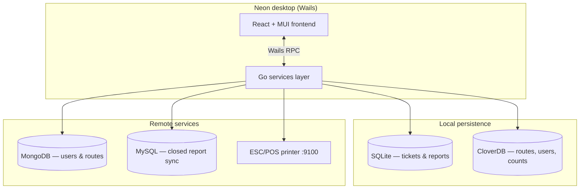

<p align="center">
  
</p>

<h1 align="center">Neon</h1>

<p align="center">
  <strong>Desktop ticketing &amp; shift management for intercity bus operations</strong><br/>
  Built for cashiers and supervisors — fast sales, live counts, thermal receipts, and cloud-backed reporting.
</p>

<p align="center">
  <a href="https://github.com/kenquiros64/neon"></a>
  <a href="https://wails.io"></a>
  
  
  
  
</p>

<p align="center">
  <a href="#-screenshots">Screenshots</a> •
  <a href="#-highlights">Highlights</a> •
  <a href="#-architecture">Architecture</a> •
  <a href="#-getting-started">Getting started</a> •
  <a href="#-configuration">Configuration</a>
</p>

<br/>

<p align="center">
  
</p>

<br/>

## Overview

**Neon** is a native desktop app ([Wails](https://wails.io)) for **Transportes El Puma Pardo**–style operations: sell regular and gold tickets at the counter, track passengers per stop in real time, run shift reports, and sync closed reports to a remote database. The UI is in Spanish, optimized for keyboard-driven cashier workflows, and supports light/dark themes.

| Role | What they do in Neon |
|------|----------------------|
| **Cashier** | Open a shift, pick route/stop/time, scan or type stop codes, sell & print tickets |
| **Supervisor** | Partial/total report close, print summaries, review history |
| **Admin** | Manage users and routes (synced from MongoDB) |

---

## Screenshots

<table>
  <tr>
    <td width="50%">
      <p align="center"><strong>Boletería — ticket desk</strong></p>
      <a href="docs/images/screenshot-ticket.png">
        
      </a>
      <p align="center"><sub>Route &amp; stop pickers, live passenger counts, barcode-style input, gold/regular fares</sub></p>
    </td>
    <td width="50%">
      <p align="center"><strong>Reportes — shift closing</strong></p>
      <a href="docs/images/screenshot-reports.png">
        
      </a>
      <p align="center"><sub>Stats cards, partial/total close, printable summaries, report history</sub></p>
    </td>
  </tr>
  <tr>
    <td colspan="2" align="center">
      <p><strong>Counter experience</strong></p>
      
      <br/>
      <sub>Departure selector, remaining time, quick regular/gold ticket actions</sub>
    </td>
  </tr>
</table>

> **Tip for your portfolio:** Replace the preview images in `docs/images/` with real captures from `wails dev` or a production build for the most accurate showcase.

---

## Highlights

### Ticket sales (Boletería)

- Three-panel layout: **input** · **routes** · **stops** with scrollable lists and active route/stop cards
- **Regular & gold** tickets with server-side **fare enforcement** (client cannot tamper with prices)
- Per-stop **passenger counters**, keyboard shortcuts, and purchase confirmation dialog
- **ESC/POS thermal printing** over Ethernet with printer health checks (ready / offline / paper)

### Reports & operations

- Start shift, **partial close**, and **total close** with validation rules
- Dashboard stats, latest reports table, **nullify ticket**, print report to thermal printer
- **MySQL sync** for closed reports (e.g. Aiven) — separate from route/user data in MongoDB

### Admin & sync

- **MongoDB** for users and routes; offline-first **CloverDB** + **SQLite** locally
- Login syncs users/routes when online; role-based access (cashier vs admin)
- Admin pages for **users** and **routes**

### UX & quality

- Material UI 7, responsive grid, toast notifications, theme switch
- Structured logging (`zap`), YAML + env configuration, embedded frontend assets in the binary

---

## Architecture



| Layer | Stack |
|-------|--------|
| **Shell** | Wails v2 — native window, Go bindings |
| **Frontend** | React 18, TypeScript, MUI, React Router, Zustand |
| **Backend** | Go — services, repositories, embedded DB drivers |
| **Print** | `go-escpos` over TCP (`PRINTER_ADDRESS` / `PRINTER_DEVICE`) |

---

## Getting started

### Prerequisites

- [Go](https://go.dev/dl/) 1.24+
- [Node.js](https://nodejs.org/) 18+ and npm
- [Wails CLI](https://wails.io/docs/gettingstarted/installation) v2

### Development

```bash
# Install frontend dependencies
cd frontend && npm install && cd ..

# Live reload (frontend + Go)
wails dev
```

Browser devtools (optional): [http://localhost:34115](http://localhost:34115)

### Production build

```bash
wails build
```

The binary is written to `build/bin/` (name from `wails.json`: `neon`).

---

## Configuration

On first run, Neon creates config under your user config directory.

| Resource | Path (Unix) |
|----------|-------------|
| MongoDB config | `~/.config/neon/config.yaml` |
| MySQL report sync | `~/.config/neon/mysql_report.yaml` |
| SQLite (tickets/reports) | `~/.config/neon/data/oxygen.db` |
| CloverDB (routes/users) | `~/.config/neon/data/titanium/` |
| Logs | `~/.cache/neon/logs/app.log` |

### MongoDB (`config.yaml`)

```yaml
host: "localhost"
port: 27017
app_name: "neon"
database: "neon"
username: "your_mongodb_username"
password: "your_mongodb_password"
ssl_enabled: false
```

Environment overrides (take precedence): `MONGO_HOST`, `MONGO_USERNAME`, `MONGO_PASSWORD`, `MONGO_APP_NAME`, `MONGO_DATABASE`.

### MySQL report sync

1. Copy `mysql_report.example.yaml` → `~/.config/neon/mysql_report.yaml`
2. Set host, database, credentials (**never commit real secrets**)
3. TLS uses system CAs; set `ca_cert_path` if your provider requires a custom CA

Overrides: `MYSQL_REPORT_HOST`, `MYSQL_REPORT_PORT`, `MYSQL_REPORT_DATABASE`, `MYSQL_REPORT_USERNAME`, `MYSQL_REPORT_PASSWORD`, `MYSQL_REPORT_CA_CERT_PATH`.

### Thermal printer

Set either:

- `PRINTER_ADDRESS` — e.g. `192.168.1.50:9100`
- `PRINTER_DEVICE` — legacy alias for the same endpoint

---

## Project structure

```
neon/
├── core/                 # Go domain: config, DB, models, repositories, services
├── frontend/             # React UI (pages, components, hooks, states)
├── docs/images/          # README & portfolio screenshots
├── main.go               # Wails entrypoint
├── wails.json            # App metadata & build settings
└── mysql_report.example.yaml
```

---

## Author

**Ken Quiros** — [github.com/kenquiros64](https://github.com/kenquiros64)

Desktop operations software: native performance, offline resilience, and a cashier-first UI.

<p align="center">
  <sub>If this project helped your portfolio or bus operation, consider starring the repo.</sub>
</p>
